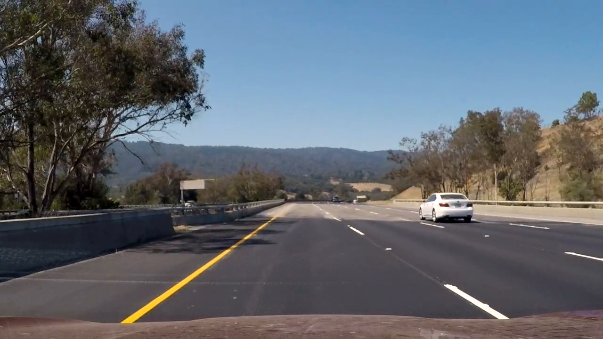
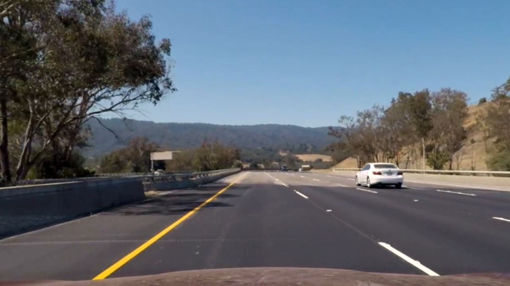
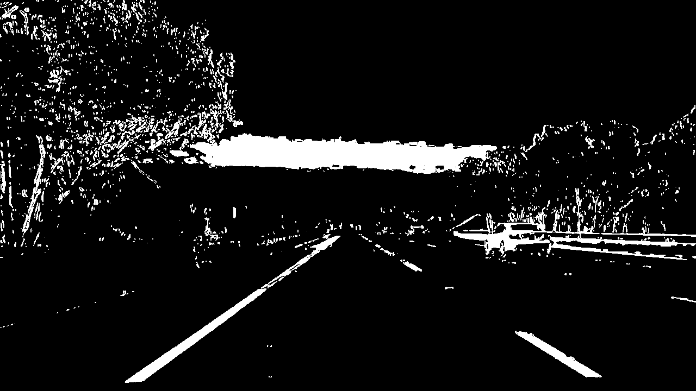
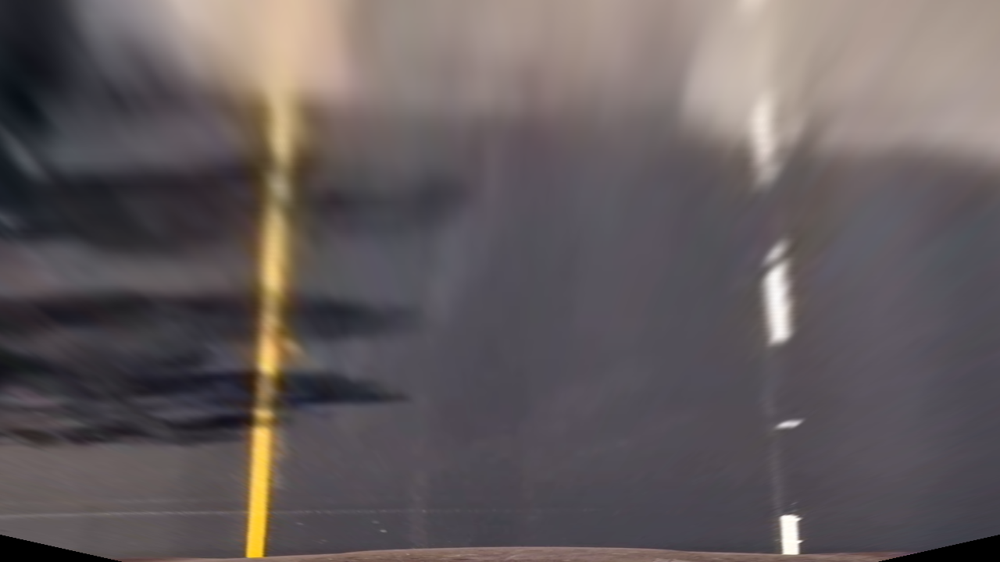
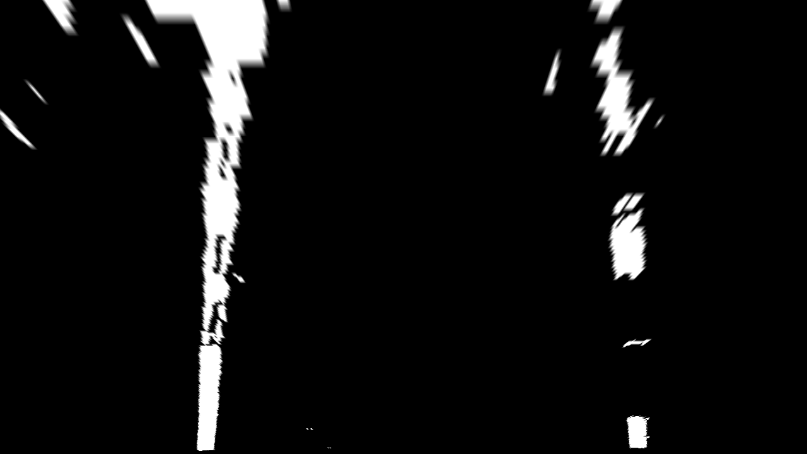
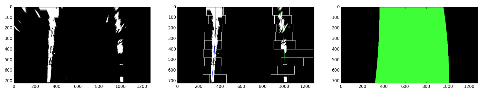
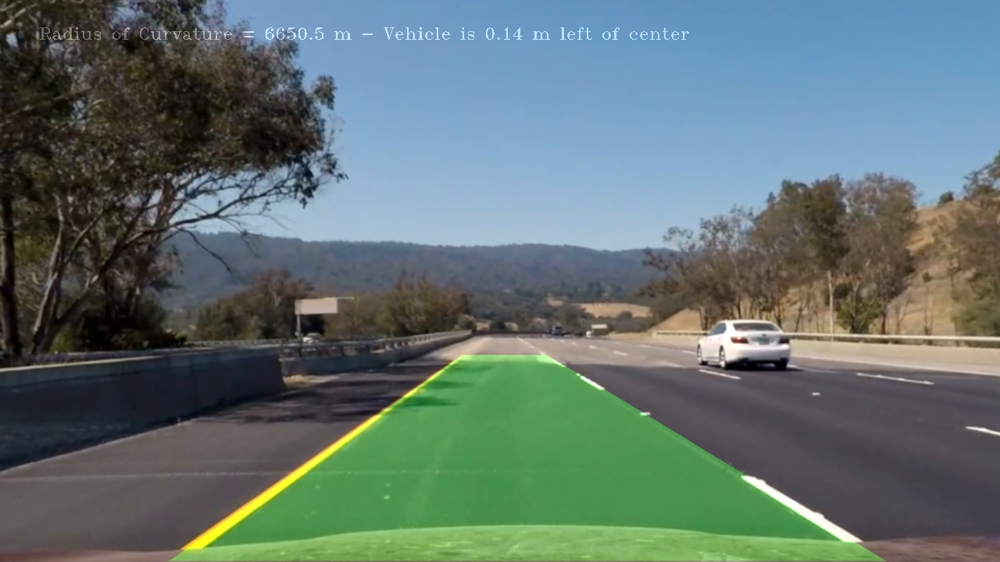

### Car-ND-Advanced-Lane-Finding

---

**Advanced Lane Finding Project**

The goals / steps of this project are the following:

* Compute the camera calibration matrix and distortion coefficients given a set of chessboard images.
* Apply a distortion correction to raw images.
* Use color transforms, gradients, etc., to create a thresholded binary image.
* Apply a perspective transform to rectify binary image ("birds-eye view").
* Detect lane pixels and fit to find the lane boundary.
* Determine the curvature of the lane and vehicle position with respect to center.
* Warp the detected lane boundaries back onto the original image.
* Output visual display of the lane boundaries and numerical estimation of lane curvature and vehicle position.

---

Here the [rubric](https://review.udacity.com/#!/rubrics/571/view) points are considered individually and descriptions are provided on how I addressed each point in my implementation:  
  
  
    
###Writeup / README
  
  
####1. Provide a Writeup / README that includes all the rubric points and how you addressed each one.  You can submit your writeup as markdown or pdf.   

I did use the template provided in the course notes and modified it. You're reading the README.md!
  
  

###Camera Calibration

####1. Briefly state how you computed the camera matrix and distortion coefficients. Provide an example of a distortion corrected calibration image.

The code for this step is contained in the function `calibrate_camera_from_path()` (lines #41 through #100 of the file named `findlanelines.py`).  
This function gets a path as input along with number of chess board corners in x and y directions and returns the camera and distortion matrices. It also has additionl kwargs (i.e. save_with_corners and save_undistort), that can be used to save the transformed images.  
The following steps were followed in the `calibrate_camera_from_path()` function:  
- Object points are prepared, which will be the (x, y, z) coordinates of the chessboard corners in the world. Here I am assuming the chessboard is fixed on the (x, y) plane at z=0, such that the object points are the same for each calibration image. Thus, `objp` is just a replicated array of coordinates. `objpoints` and `imgpoints` are then initialized as empty lists: `objpoints` will be appended with a copy of `objp` every time the program successfully detects all chessboard corners in a test image. `imgpoints` will be appended with the (x, y) pixel position of each of the corners in the image plane with each successful chessboard detection;  
- Program uses the glob library to read all files fitting `calibration*.jpg` naming conventions that are located in the path given as input;  
- For each image that is read, `cv2.findChessboardCorners()` is called to find the chessboard corners;  
- If save_with_corners kwarg is True, then file is saved with chessboard corners drawn on it;  
- Function `cv2.calibrateCamera()` is then called with 'objpoints' and 'imgpoints' and the camera and distortion matrices are calcualted;  
- If save_undistort kwarg is True, then file is undistorted using `cv2.undistort()` function and then saved;  
- The function returns the camera matrix and distortion matrix at the end.  

Examples of the original image, original image with chessboard corners drawn on it, and undistorted images are shown below:  

| Original Image | with Chessboard Corners Drawn | Undistorted |
|:--------------:|:-----------------------------:|:-----------:| 
|  |  |  |
  
  
  
###Pipeline (single images)
  
  
####1. Provide an example of a distortion-corrected image.
A classe named `ImageTransform` is created for the sole purpose of manipulating images. This class (which is contained in file `imagetransform.py`) gets an array of images, an array of labels as well as camera and distorsion matrices obtianed previously plus the colorspec of the images. This class has many methods to manipulate images. One of the methods is named `to_undistort()` (from line 238 to 243), which is called when the class is created in `__init__()` method, and calls `cv2.undistort()` method to undistort the images. Gaussian blur (using `cv2.GaussianBlur()`) is also applied to the images in the `__init__()` method prior to undistorting the images. The images are also converted to RGB colorspec after undistorting in the `__init__()`. The follwoing images show a random frame that is in the original format plus the same frame after blurring / undisotrting:

| Original Frame | Blurred and Undistorted | 
|:--------------:|:-----------------------:|  
|  |  |
  
  
####2. Describe how (and identify where in your code) you used color transforms, gradients or other methods to create a thresholded binary image.  Provide an example of a binary image result.
A combination of color and gradient thresholds were used to generate a binary image. Thresholding occurs in method `process_images()` in class `ImageTransform`, which is contained in file `imagetransform.py` (from line 588 to line 667). The following steps were followed:  
- the thresholding was done based on gradient only. Various additional methods such as the following were defined and used to perform thresholding:  
  - `get_canny()`: from line 294 to line 303 of `imagetransform.py` was used to obtain Canny transformation. Threshold values of (145,150) were used as inputs to this method.  
  - `get_angle_sobel_thresh()`: from line 360 to 385 of `imagetransform.py` was used to peform thresholding based on the gradient angles using `cv2.Sobel()` method. Threshold values of (0.8,1.2) were used as inputs to this method.  
  - `get_mag_sobel_thresh()`: from line 335 to 356 of `imagetransform.py` was used to peform thresholding based on the magnitude of the gradients. Threshold values of (30,100) were used as inputs to this method.  
  - `get_dir_sobel_thresh()`: from line 308 to 331 of `imagetransform.py` was used to peform thresholding based on the directional gradient values using `cv2.Sobel()` method. Threshold values of (25 for x direction and 35 for y direction,110) were used as inputs to this method.  
- The weighted average of all output binary images were taken (i.e. voting on pixel values), and a passing grade is specified. If the result of the weighted average is more than the passing grade, the pixel is set to 1, otherwise to 0. The weights used for averaging and the passing grade were determined through multiple iterations of trial and error to see which combination works best.  
- The thresholding was then done based on color only. Various additional methods such as the following were defined and used to perform thresholding:  
  - `get_R_thresh()`: from line 389 to 401 of `imagetransform.py` was used to peform thresholding based on the R channel. Threshold values of (200,255) were used as inputs to this method.  
  - `get_G_thresh()`: from line 421 to 433 of `imagetransform.py` was used to peform thresholding based on the G channel. Threshold values of (160,255) were used as inputs to this method.  
  - `get_B_thresh()`: from line 405 to 417 of `imagetransform.py` was used to peform thresholding based on the B channel. Threshold values of (90,255) were used as inputs to this method.  
  - `get_H_thresh()`: from line 437 to 449 of `imagetransform.py` was used to peform thresholding based on the H channel. Threshold values of (20,50) were used as inputs to this method.  
  - `get_S_thresh()`: from line 469 to 481 of `imagetransform.py` was used to peform thresholding based on the S channel. Threshold values of (80,255) were used as inputs to this method.  
  - `get_L_thresh()`: from line 453 to 465 of `imagetransform.py` was used to peform thresholding based on the L channel. Threshold values of (130,255) were used as inputs to this method.  
  - `get_gray_thresh()`: from line 485 to 497 of `imagetransform.py` was used to peform thresholding based on the grayscale pixel values. Threshold values of (180,255) were used as inputs to this method.  
- Similar to the gradient thresholding, the weighted average of all output binary images were taken (i.e. voting on pixel values), and a passing grade is specified. If the result of the weighted average is more than then passing grade the pixel is set to 1, otherwise to 0. The weights used for averaging and the passing grade were determined through multiple iterations of trial and error to see which combination works best.  
- The binary images resulting from color thresholding and gradient thresholding were then combined using `or` operator (i.e. pixels have non-zero values if either of the outputs have non-zero values). Note that although binary images are created, the non-zero pixel values are set to 255 to make it easier later on when things are drawn on the images.  
  
Example of binary images created from a random frame is shown below:

| Original Frame | Processed Binary Image | 
|:--------------:|:----------------------:|  
|  |  |
  
  
####3. Describe how (and identify where in your code) you performed a perspective transform and provide an example of a transformed image.

The `ImageTransform` class contains a method named `to_birds_eye()` (lines 197 to 227 of `imagetransform.py`), which uses `cv2.getPerspectiveTransform()` function to calculate the transfromation matrix and then uses `cv2.warpPerspective()` furnction to transform the images to a birds eye view. `to_birds_eye()` method has two kwargs (i.e. `original` and `processed`), based on which the perspective transformation would be performed on original images, and/or the processed binary images that are already exist in the object. The source and destination points for the transformation are initialized in `__init__()` method of the class (lines 47 to 55 of `imagetransform.py`:

```
self._p_0 = np.float32([[0.10,1.0]])
self._p_1 = np.float32([[0.43,0.65]])
self._p_2 = np.float32([[0.57,0.65]])
self._p_3 = np.float32([[0.90,1.0]])

self._q_0 = np.float32([[0.20,1.0]])
self._q_1 = np.float32([[0.20,0.3]])
self._q_2 = np.float32([[0.80,0.3]])
self._q_3 = np.float32([[0.80,1.0]])
```
The values are in fraction of the image size in each direction and are multiplied by the image width/height respectively in `to_birds_eye()`method before the transformation is applied. This allows images of any arbitrary size to be processed without any errors.  

Example of birds eye perspective transformation of the original and binary images are shown below:  

| Description | Original Frame | Processed Binary Image | 
|:------------|:--------------:|:----------------------:|  
| Before Perspective Transformation |  |  |
| After Perspective Transformation |  |  |
  
As noted from above example photos, the perspective transform works properly as the lines appear parallel in the warped image.


####4. Describe how (and identify where in your code) you identified lane-line pixels and fit their positions with a polynomial?

The `ImageTransform` class contains a method named `detect_lanes()` (lines 671 to 874 of `imagetransform.py`), which identifies the lane pixels and fit their position with a polynomial. The previous base position of the left and right lanes can be provided as arguments to this method (i.e. `prev_left_pos` and `prev_right_pos`). A `verbose` argument is also provided to the method, which if True will plot the results during the operation. The following is performed in the method:  
- If `prev_left_pos` and `prev_right_pos` arguments are None, then a blind search is performed by calculating the histogram in the bottom half of the picture and searching for the maximum points of that histogram in the right and left portion of that histogram (lines 703 to 721 of `imagetransform.py`).  
- Once an initial position is established for both left and right lanes, a narrower window search is performed iteratively from bottom of the picture upwards (lines 724 to 787 of `imagetransform.py`). Variable `num_horizontal_bands` determines the number of window searches that would be performed covering the full height of the image (initially set to 10 here). The height of the search window in each iteration is constant and is calculated based on the `num_horizontal_bands` and the height of the image.  
- In each iteration, the search window is centered on the anticipated location of the lane, which is determined from the previous search (i.e. the position of the search window changes dynamically). The width of the search window is dynamically changed as well depending on the confidence level and previous finding results. Variables `min_x_margin`, `max_x_margin` and `margin_ultiplier` control the width of the search window in each step based on the following rules:  
  - If the confidence level was found to be low in the previous search attempt, then the width is multiplied by margin_ultiplier, otherwise it would be devided by the margin_ultiplier to focus the search on the lane only  
  - The width of the search window is capped to be between 2 x min_x_margin and 2 x max_x_margin  
- All points in the search windows are considered valid lane lines and all other piexels are discarded.  
- `np.polyfit()` function is then used (lines 795 to 807 of `imagetransform.py`) to calculate the best polyfit parameters of order 2. The poly fit parameters were obtained using both pixel coordinates and real coordinates. Real coordinates are obtained by multiplying the pixel coordinates (from a birds eye picture) to conversion factors `_xm_per_pix` and `_ym_per_pix`, which are set in the `__init__()` method of the class.  
- Once polyfit parameters are obtained, the fitted xvalues of the lane lines are calcualted for plotting purposes (lines 809 to 812 of `imagetransform.py`).  
- Curvature radii and base positions of the lane lines were then calculated (lines 822 to 836 of `imagetransform.py`) using formulas that were discussed in the course notes.  
- `cv2.fillPoly()` function was used then to create a solid fill image for verbose mode.
- The results are returned in a dictionary for each of the left and right lanes.  

The following image shows the steps taken in `detect_lanes()` method (i.e. the output of the verbose mode):



The left image is the processed binary image, the middle image shows the window search process from bottom of the image upwards plus the fitted polylines, and the right image above shows the result of the lane finding after `cv2.fillPoly()` function is used to hatch between the fitted polylines.

####5. Describe how (and identify where in your code) you calculated the radius of curvature of the lane and the position of the vehicle with respect to center.

As noted in the answer to the previous question, this is done in method `detect_lanes()` contained in the `ImageTransform` class (lines 822 to 836 of `imagetransform.py`). The following is the code used for this calculation:

```
# Calculate curvature radii for left and right lane and the average thereof
y_eval = img_height*self._ym_per_pix
left_curverad = ((1 + (2*left_fit_cr[0]*y_eval + left_fit_cr[1])**2)**1.5) \
                         /np.absolute(2*left_fit_cr[0])

right_curverad = ((1 + (2*right_fit_cr[0]*y_eval + right_fit_cr[1])**2)**1.5) \
                                /np.absolute(2*right_fit_cr[0])   

# Calculate off-center location of the car assuming the centre of the image is the centre of teh car
center_position = img_width//2
left_lane_pos = center_position - left_fit_x[-1]
right_lane_pos = center_position - right_fit_x[-1]
off_center = np.mean((left_lane_pos, right_lane_pos))

# converting ot m            
left_lane_pos *= self._xm_per_pix
right_lane_pos *= self._xm_per_pix
off_center *= self._xm_per_pix
```

y_eval is initially set to `img_height*self._ym_per_pix` in order to calculate the results at the bottom of the image, where the car is located. note that the polyfit parameters `left_fit_cr` and `right_fit_cr` are already based on real coordinates. The position of the lanes are converted to the real coordinates by multiplying by the conversion factors.

####6. Provide an example image of your result plotted back down onto the road such that the lane area is identified clearly.

Method `plot_fitted_poly()` in class `ImageTransform` performs the task of plotting the resutls on the original image. It takes arguments `fitted_poly_list`, which is the polyfit parameters for left and right lanes and `labels`, which is the optional text that will be printed on the image. Below is an example output of the function, which is plotted side by side with the original frame:

| Original Frame | Final Processed Image | 
|:--------------:|:---------------------:|  
|  |  |


###Pipeline (video)

####1. Provide a link to your final video output.  Your pipeline should perform reasonably well on the entire project video (wobbly lines are ok but no catastrophic failures that would cause the car to drive off the road!).

Here's a [link to my video result](./AK_project_video.mp4)

---

###Discussion

####1. Briefly discuss any problems / issues you faced in your implementation of this project.  Where will your pipeline likely fail?  What could you do to make it more robust?

The following challenges were encoutered and resolved during the implementation of this project:  
- Automatically evaluating the lane lines and determining if they make sense was challenging. For that I had to check the difference between the positions of the left and right lanes, difference in 1/curve_rad of the right and left lanes, and the difference between the fitploy parameters of left and right lanes. However, not knowing how those values changed during the video was challenging. I ended up creating a log file during the video porcessing, which stored all pertinent parameters for the left and right lanes. Based on this data the decision bounds were selected to correctly identify whether lanes are valid.  
- I defined a class named `LaneLine()` in file `lanelines.py`, which keeps track of the position of the lanes duirng a video stream. Each time a result is passed on to the object, it evaluates the lane lines compared to the position and curvature of the previous iterations and decides if the lane is correctly detected. If not detected, the anticipated location of the lane based on the results  of the previous n frames is returned when needed. If correctly detected, then the result would be added to the list.  
- To make the code more robust I elected to have class `ImageTransform` get an array of images as input instead of just a single image. This helps if multiple cameras are installed on the car. Also all operations are independent of the size of the images that are passed on.  

The following are likely conditions that may result in failure of the pipeline:
- The thresholding works for the project video, but is sensitive to the colors / gradients. Therefore in poor weather conditions, of if reflections off the front glass are severe the pipeline may fail.  
- Shadows close to the lanes (i.e. due to barriers, etc.) may pose challenges to identifying lanes.  

What could be done to make the pipeline more robust:
- Combining Hough transform that was used in project 1 with the color and gradient thresholding may result in a more robust pipeline.
- Masking the region of interest may also result in more robust implementation and avoiding false lane detections too far away from the lanes.
